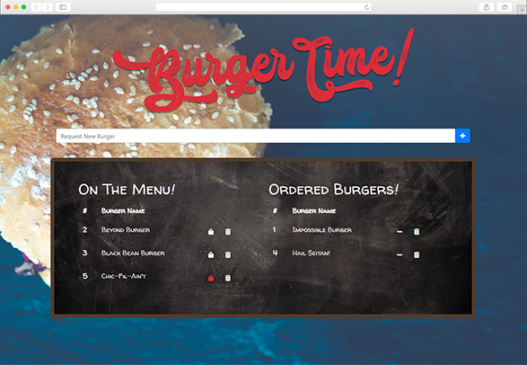
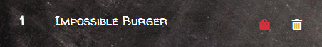

     

## Overview
BurgerTime! Order Form is a logger, created with MySQL, Node, Express, Handlebars, and a homemade ORM. 

## Languages/Technologies Used
- HTML, CSS, JavaScript
- [Bootstrap 4.3.1](https://getbootstrap.com/docs/4.3)
- [Node](https://nodejs.org/en/docs/)
    - [Express 4.x](https://expressjs.com/en/4x/api.html)
    - [Express-Handlebars 3.1.10](https://www.npmjs.com/package/express-handlebars)
    - [MySQL 2.17.1](https://www.npmjs.com/package/mysql)

## Getting Started
Visit https://stark-dusk-48972.herokuapp.com/.

### Prerequisites
- An internet browser with JavaScript enabled.

### Instructions
#### Order a Burger
Users should click the `shopping bag icon` to add a burger to the ***Ordered Burgers*** list.

#### Remove Burger from Order
Users should click the `minus icon` to remove an ordered burger and add it back to the ***On the Menu*** list.

#### Delete a Burger
Users should click the `trashcan icon` to permanently delete a burger from the page.

#### Add a Burger
To add a new burger, users should enter the burger name into the Request New Burger field, then click the `plus icon`.
